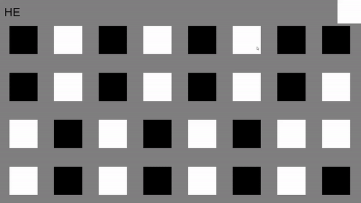
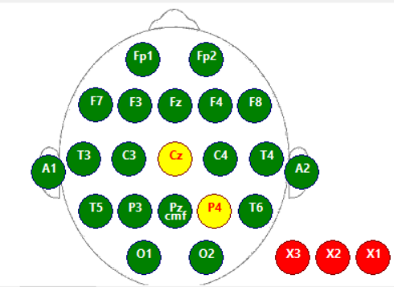
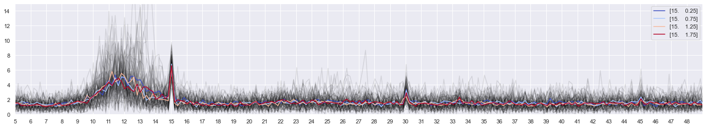
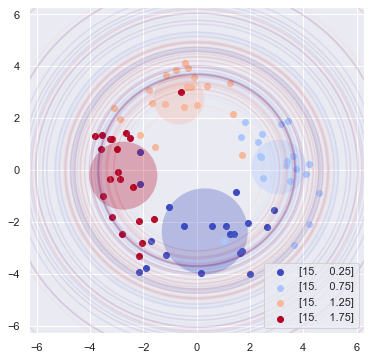
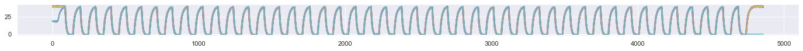
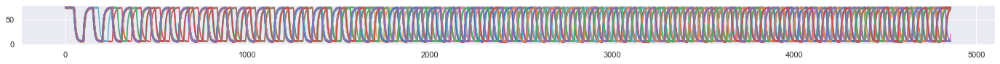
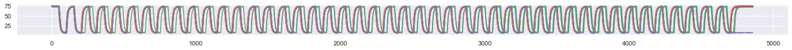
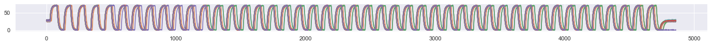

# Oz-Speller: A Fast Occipital Channel-Driven Steady-State Visual Evoked Potential-Based Virtual Keyboard

## _**1.2**_-second speed, 85% accuracy, 32 choices
Check, check, and check. This is the **ultimate EEG spelling machine** combined with an intelligent companion app with a chatbot that uses a **GPT-based language model**. Designed with locked-in patients in mind so they can communicate with their caretakers more efficiently, it is user-centric as it is powerful. All that _**speed**_ is right in front of your retina, made more available than ever. Simply type in a few lines of code in your command line, and you have it. 

## Presentation Video 

 

 

---

## Getting Started
- Run `pip install -r requirements.txt` to install the dependencies.
- In [`/scripts`](https://github.com/NeuroTech-UCSD/Project-Template/tree/main/scripts), `python main.py` will run the app.
- Upload the entire project folder to Google drive, and open the .ipynb files in Colab to run the demo notebooks.

## Github Directories
<!--  -->
- [`/data`](https://github.com/NeuroTech-UCSD/Project-Template/tree/main/data) - Where the recorded eeg data, intermediate variables, and analysis results for plotting the figures will be stored. 
	- [`/data/eeg_recordings`](https://github.com/NeuroTech-UCSD/Project-Template/tree/main/data/eeg_recordings) - Contains different sessions of EEG recordings.
- [`/figures`](https://github.com/NeuroTech-UCSD/Project-Template/tree/main/figures) Stores all of the figures generated by the scripts. 
- [`/notebooks`](https://github.com/NeuroTech-UCSD/Project-Template/tree/main/notebooks) Demo notebooks illustrating the data processing and modeling pipeline. 
- [`/scripts`](https://github.com/NeuroTech-UCSD/Project-Template/tree/main/scripts) Each script is for a particular processing stage.
	- [`/scripts/main.py`](https://github.com/NeuroTech-UCSD/Project-Template/blob/main/scripts/main.py) - The scripts that runs the entire project pipeline, combining all of the processing scripts.
- [`/src`](https://github.com/NeuroTech-UCSD/Project-Template/tree/main/src) - Modular code files that are meant to be imported by different scripts.
	- [`/src/funcs.py`](https://github.com/NeuroTech-UCSD/Project-Template/blob/main/src/funcs.py) - Modular data processing functions for the script files to use.
	- [`/src/utils.py`](https://github.com/NeuroTech-UCSD/Project-Template/blob/main/src/utils.py) - Modular utility functions such as ploting, loading, and saving the data.
	- [`/src/custom_module.py`](https://github.com/NeuroTech-UCSD/Project-Template/blob/main/src/custom_module.py) - Can have different names. Where we define custom classes for modeling, GUI, etc.

## Reproduce GUI without headset (dockerized)
Editing...

## Reproduce GUI with headset
### Record the dataset
- Configure DSI-24 or configure code for other EEG headsets
- Open [`/scripts/psychopy_competition.py`](https://github.com/NeuroTech-UCSD/Oz-Speller/blob/main/scripts/psychopy_competition.py) with your preferred text editor. Scroll to the subsection `VARIABLES`: 
  - Set `use_dsi_lsl` to `True`
  - Set `test_mode` to `True`
  - Set `make_predictions` to `False`
  - (optional) Set `stim_duration` to `5` or higher if you want to validate the data with spectral analysis
  - Save and exit
- From the root directory, run `python scripts/psychopy_competition.py` and perform the calibration process, which should take at least 5 minutes.
- Move `eeg.csv` and `meta.csv` from the root directory to `/data/eeg_recordings/DSI-24/[YOUR_NAME]/run[x]`. You can replace `DSI-24` with a different folder name if you set up the code to work with a different headset.
- Repeat the last 2 steps at least 3 times if you want to use the dataset to train FBTDCA.
### Train the Model
- Open [`/notebooks/TriggerHubData.ipynb`](https://github.com/NeuroTech-UCSD/Oz-Speller/blob/main/scripts/psychopy_competition.py) with your preferred text editor. 
- On the 3rd cell:
  - Set `sub_dirs` to the appropriate number of runs
  - Within the for loop, find `data_path` and change the first string to `/data/eeg_recordings/DSI-24/[YOUR_NAME]/`.
- Run the first 4 cells in order.
### Use the model in real-time
Once you have successfully trained the model:
- On the 5th cell, change the first string in `open()` to `'/reports/trained_models/32-class_speller/DSI-24/[YOUR_NAME]/fbtdca_1s.pkl'`
- Run the 5th cell
- Open [`/scripts/psychopy_competition.py`](https://github.com/NeuroTech-UCSD/Oz-Speller/blob/main/scripts/psychopy_competition.py) with your preferred text editor. Scroll to the subsection `VARIABLES`: 
  - Set `use_dsi_lsl` to `True`
  - Set `test_mode` to `True` if you want to check the accuracy or `False` if you want to enable the virtual keyboard.
  - Set `make_predictions` to `True`, and set the first string under `open()` to `'/reports/trained_models/32-class_speller/DSI-24/[YOUR_NAME]/fbtdca_1s.pkl'`
- From the root directory, run `python scripts/psychopy_competition.py` 
### Configure DSI-24
- Follow the setup instruction for DSI-24 on the Wearable Sensing's [official website](https://wearablesensing.com/dsi-24/). Use the **DSI Streamer** by Wearable Sensing to ensure low impedance for the electrodes, particularly the common reference and the occipital channels.
 
<!--  -->
</img>
 

- Open [`/scripts/psychopy_competition.py`](https://github.com/NeuroTech-UCSD/Oz-Speller/blob/main/scripts/psychopy_competition.py) with your preferred text editor. Scroll to the subsection `if use_dsi_lsl`: 
  - Change `'--port=COM15'` to the port DSI-24 is assigned to
  - Change the `'COM14'` in `dsi_serial = serial.Serial('COM14', 9600)` to the port the Trigger Hub is assigned to
- Contact Wearable Sensing for further assistence if needed.

## Data validation
### Spectral Analysis check with FFT : Oscillatory peaks and Phase offset (figure)
The speller is able to classify each trial in just 1.2 second, but to see the oscillation peak in the spectral domain more clearly for signal quality validation purposes longer stimulation duration is recommended. Here is an example of the oscillatory peak in the EEG using Fast Fourier Transform (FFT) from multiple trials of 5-second long 15Hz flashing:  

 
If your EEG system is timed well, you should even be able to visualize the phase angles in addition to the frequency amplitude using FFT through a diagram called complex spectrum. Here is an example of the separation of phase angles in the complex spectrum for the same data:  
  
Each dot represents the phase angle of 15Hz for a single trial. Each color represents a phase-offset orthogonal to the other ones. The larger circle around the dots represents the "spread" of the phase angles for that particular phase-offset. And the outer-most circles represents the largest oscillatory amplitude for that single trial.

### Photosensor (figure)
One of the most common causes of low accuracy for an SSVEP speller is low timing precision. We chose **PsychoPy** as the stimulus presentation software because of its ability to present visual stimuli at a frame-by-frame fashion to ensure good timing. Extra care was taken to ensure frame-skips happen as little as possible when large number of stimuli are flashing simultaneously by using `ElementArrayStim`, which optimizes the shader rendering. But in case of frame skips due to hardware variations, you can check whether your stimuli are presented properly using a TEMT6000 photosensor connected to an arduino. Here is an example of what the photosensor data should look like if there is no frame-skips:  

 
And below are examples of what it would look like if there are frame skips:
 

 
 
 
 
 

### Trigger Hub
If you choose to use DSI-24, we recommend using it with the Wearable Sensing Trigger Hub to ensure the best timing possible with your headset. Connect the photo-trigger to the Trigger Hub and attach it to the top-right corner of the screen so that it can detect when a trial has started. In the `eeg.csv` data, the marker stream from the Trigger Hub corresponds to the `TRG` channel, and it is 16 when light is detected, and 0 otherwise. So the onset of a trial is the first sample point where `TRG` goes from 0 to 16.

## Data Analysis & Models
### Arico dataset
### 36-class dataset 
### Competition dataset

## Acknowledgement
Put the team and partners here.
- Wearable Sensing
- Brainda EEG modeling toolkit: 
- TRCA:
- TDCA:
- EEGNet: https://github.com/vlawhern/arl-eegmodels
- Visual Delay: https://www.pnas.org/doi/10.1073/pnas.1508080112
- Frame index flashing: https://sccn.ucsd.edu/~yijun/pdfs/EMBC14c.pdf
