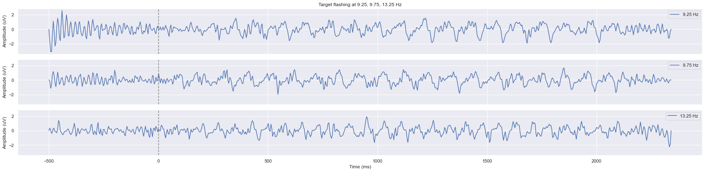
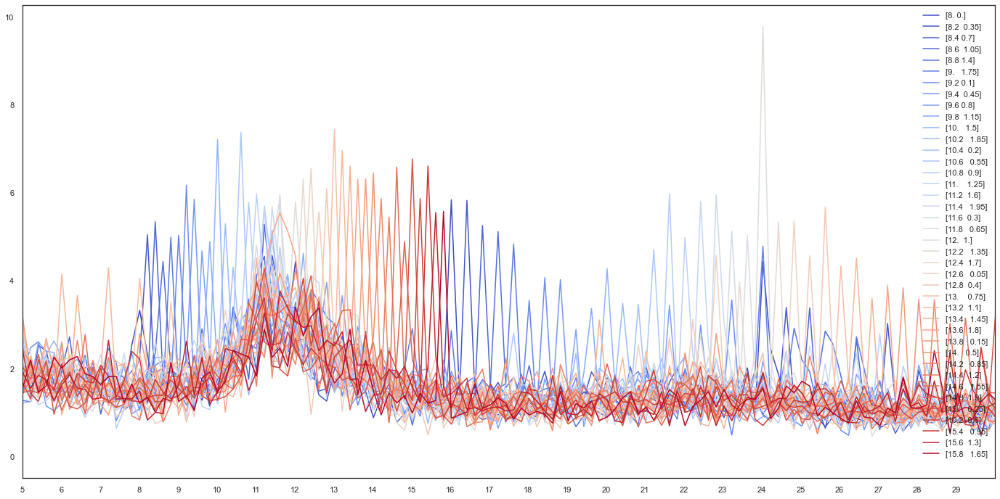
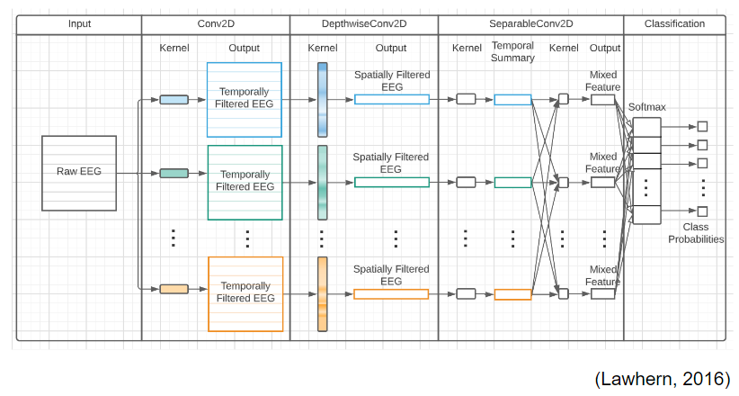
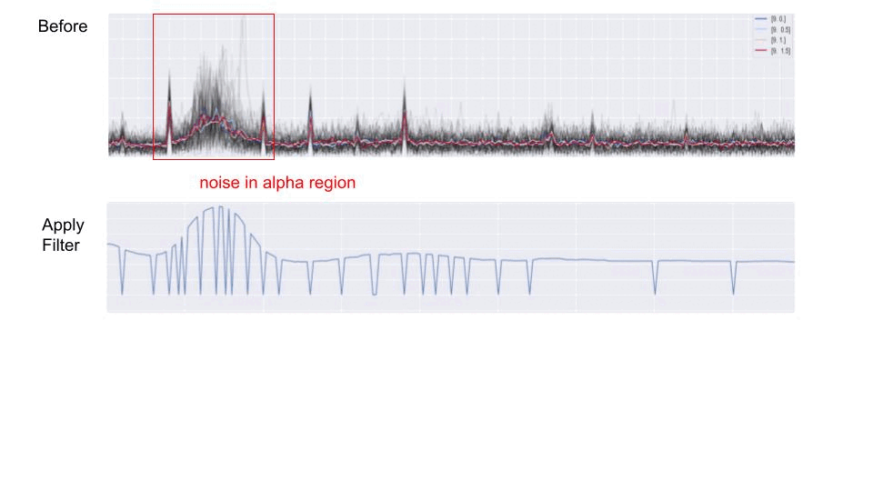
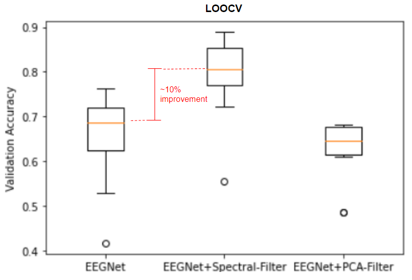
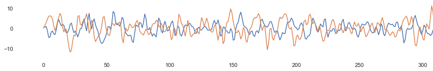
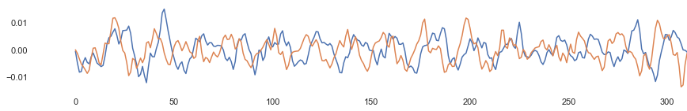
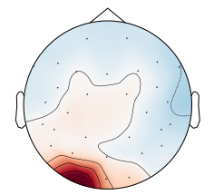
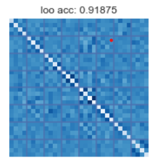
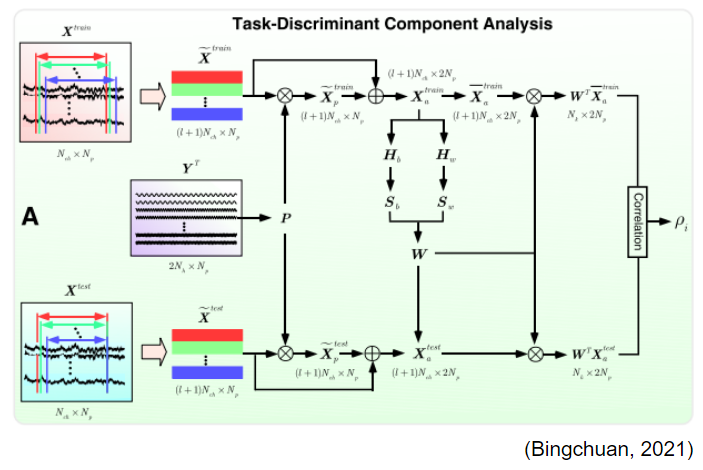

# Oz-Speller: A Fast Occipital Channel-Driven Steady-State Visual-Evoked Potential-Based Virtual Keyboard

## _**1.2**_-second speed, 85% accuracy, 32 choices
Check, check, and check. This is the **ultimate EEG spelling machine** combined with an intelligent companion app with a
chatbot that uses a **GPT-based language model**. Designed with locked-in patients in mind so they can communicate with
their caretakers more efficiently, it is powerful as it is user-centric. All that _**speed**_ is right in front of your
retina, made more available than ever. Simply type in one line of code in your command line, and you have it. 

## Presentation Video

 

 

---

## Getting Started

Simply run ***one line of code*** to reproduce everything you see in the video above!

- First make sure your phone and your laptop (ideally Windows) are connected to the same wifi

#### Reproduce entire app

- Simply type `make APP_PORT=<PORT> HOST_ADDR=<ipv4> app`, where PORT can be any port (ideally 4002) and ipv4 is the
  ipv4 address of your wifi. This one line of code will download all the dependencies and docker images for you, then trigger the chatbot, the
      companion app, as well as the Psychopy GUI as shown in the video below:  
    

#### Reproduce only the Psychopy GUI

- Simply type `make speller` to run only the Psychopy GUI and control it with your keyboard, more detailed description
  in [Reproduce GUI without Headset]() section
  

#### Reproduce the chatbot, companion app with Psychopy GUI simulator

- Simply type `make APP_PORT=<PORT> HOST_ADDR=<ipv4> speller_sim` to use a command prompt in the place of psychopy gui,
  which offers more flexibility in testing other parts of the code, as shown below:
  
 

#### Microservices
The companion app is developed in the repo: https://github.com/NeuroTech-UCSD/ssvep-ui, and the chatbot is developed in the repo: https://github.com/NeuroTech-UCSD/Conversational-Agents-for-Hospitalized-Agents. Their docker images are stored in the corresponding github package registry published via git action. 

## Github Directories

<!--  -->

- [`/data`](./data) - Where the recorded eeg data, intermediate variables, and analysis results for plotting the figures
  will be stored.
    - [`/data/eeg_recordings`](./data/eeg_recordings) - Contains different sessions of EEG recordings.
- [`/reports`](./reports) Contains the results generated by our analyses, including trained models and figures.
    - [`/reports/figures`](./reports/figures) Stores all of the figures generated by the code.
    - [`/reports/trained_models`](./reports/trained_models) Stores the trained models used by the speller.
- [`/notebooks`](./notebooks) Jupyter notebooks for data processing and modeling pipeline.
- [`/scripts`](./scripts) The scripts are used to conduct the experiment, collect EEG, and communicate with the
  caretaker app.
    - [`/scripts/oz-speller.py`](./scripts/oz-speller.py.py) - The scripts that runs the entire project pipeline,
      combining all of the processing stages.
    - [`/scripts/oz-speller_without-headset.py`](./scripts/psychopy_competition.py.py) - A dummy version of the
      Oz-Speller that is controlled by a physical keyboard.
- [`/src`](./src) - Code files that are meant to be imported by different scripts.

## Reproduce GUI without Headset

For clubs without DSI headset, no problem. You can interact with the GUI with your keyboard:
#### Input screen 1

#### Input screen 2

#### Home screen

NOTE: "clear screen" clears the text message the user is inputing. It needs to be activated twice consecutively to take effect. This is to avoid accidental deletion of the message the user is inputing.

## Reproduce GUI with Headset

### Record the dataset

- Configure DSI-24 or configure code for other EEG headsets
- Open [`/scripts/oz-speller.py`](./scripts/oz-speller.py) with your preferred text editor. Scroll to the
  subsection `VARIABLES`:
    - Set `use_dsi_lsl` to `True`
    - Set `test_mode` to `True`
    - Set `make_predictions` to `False`
    - (optional) Set `stim_duration` to `5` or higher if you want to validate the data with spectral analysis
    - Save and exit
- From the root directory, run `python scripts/oz-speller.py` and perform the calibration process, which should take at
  least 5 minutes.
- Move `eeg.csv` and `meta.csv` from the root directory to `/data/eeg_recordings/DSI-24/[YOUR_NAME]/run[x]`. You can
  replace `DSI-24` with a different folder name if you set up the code to work with a different headset.
- Repeat the last 2 steps at least 3 times if you want to use the dataset to train FBTDCA.

### Train the model

- Open [`/notebooks/TriggerHubData.ipynb`](./notebooks/TriggerHubData.ipynb) with your preferred text editor.
- On the 3rd cell:
    - Set `sub_dirs` to the appropriate number of runs
    - Within the for loop, find `data_path` and change the first string to `/data/eeg_recordings/DSI-24/[YOUR_NAME]/`.
- Run the first 4 cells in order.

### Use the model in real-time

Once you have successfully trained the model:

- On the 5th cell, change the first string in `open()`
  to `'/reports/trained_models/32-class_speller/DSI-24/[YOUR_NAME]/fbtdca_1s.pkl'`
- Run the 5th cell
- Open [`/scripts/oz-speller.py`](./scripts/oz-speller.py) with your preferred text editor. Scroll to the
  subsection `VARIABLES`:
    - Set `use_dsi_lsl` to `True`
    - Set `test_mode` to `True` if you want to check the accuracy or `False` if you want to enable the virtual keyboard.
    - Set `make_predictions` to `True`, and set the first string under `open()`
      to `'/reports/trained_models/32-class_speller/DSI-24/[YOUR_NAME]/fbtdca_1s.pkl'`
- From the root directory, run `python scripts/oz-speller.py`

### Configure DSI-24

- Follow the setup instruction for DSI-24 on the Wearable
  Sensing's [official website](https://wearablesensing.com/dsi-24/). Use the **DSI Streamer** by Wearable Sensing to
  ensure low impedance for the electrodes, particularly the common reference and the occipital channels.
   

<!--  -->
</img>
 

- Open [`/scripts/oz-speller.py`](./scripts/oz-speller.py) with your preferred text editor. Scroll to the
  subsection `if use_dsi_lsl`:
    - Change `'--port=COM15'` to the port DSI-24 is assigned to
    - Change the `'COM14'` in `dsi_serial = serial.Serial('COM14', 9600)` to the port the Trigger Hub is assigned to
- Contact Wearable Sensing for further assistence if needed.

## Data Validation

### Spectral analysis check with FFT : Oscillatory peaks and phase offset

The speller is able to classify each trial in just 1.2 second, but to see the oscillation peak in the spectral domain
more clearly for signal quality validation purposes longer stimulation duration is recommended. Here is an example of
the oscillatory peak in the EEG using Fast Fourier Transform (FFT) from multiple trials of 5-second long 15Hz
flashing:  

 
If your EEG system is timed well, you should even be able to visualize the phase angles in addition to the frequency
amplitude using FFT through a diagram called complex spectrum. Here is an example of the separation of phase angles in
the complex spectrum for the same data:  
  
Each dot represents the phase angle of 15Hz for a single trial. Each color represents a phase-offset orthogonal to the
other ones. The larger circle around the dots represents the "spread" of the phase angles for that particular
phase-offset. And the outer-most circles represents the largest oscillatory amplitude for that single trial.

### Photosensor

One of the most common causes of low accuracy for an SSVEP speller is low timing precision. We chose **PsychoPy** as the
stimulus presentation software because of its ability to present visual stimuli at a frame-by-frame fashion to ensure
good timing. Extra care was taken to ensure frame-skips happen as little as possible when large number of stimuli are
flashing simultaneously by using `ElementArrayStim`, which optimizes the shader rendering. But in case of frame skips
due to hardware variations, you can check whether your stimuli are presented properly using a TEMT6000 photosensor
connected to an arduino. Here is an example of what the photosensor data should look like if there is no
frame-skips:  

 
And below are examples of what it would look like if there are frame skips:
 

 

 

 

### Trigger Hub

If you choose to use DSI-24, we recommend using it with the Wearable Sensing Trigger Hub to ensure the best timing
possible with your headset. Connect the photo-trigger to the Trigger Hub and attach it to the top-right corner of the
screen so that it can detect when a trial has started. In the `eeg.csv` data, the marker stream from the Trigger Hub
corresponds to the `TRG` channel, and it is 16 when light is detected, and 0 otherwise. So the onset of a trial is the
first sample point where `TRG` goes from 0 to 16.

## Data Analysis and Models

### Arico dataset

The Arico Dataset is a public dataset we initally used to learn about SSVEP as well as using a benchmark on what our own
dataset is supposed to look like. When enough trials are time-avaraged, a good-quality SSVEP signal should look
oscillatory roughly 0.14 second after the onset of the flashing stimulus:
 

 

### 32-class center-flash dataset

Hour-long pilotings were done with EEG from looking at a single square flashing at the center of the screen. Inital
breakthough came where we first detect oscillatory peaks in the EEG data after months of trial-and-error:
 

 
From there we validated the presence of oscillations from DSI-7 and produced figures such as this
 

 
But it proved difficult to validate phase offsets when they are spaced out so evenly. So to better validate the presense
of phase-offsets in the EEG data, we scaled the amount of classes down to 32 and used only 4 phases for each of 8
frequencies, rather than 1 unique phase for each unique frequency.  
At this stage, we also implemented a state-of-the-art deep learning model on the 32-class SSVEP data we recorded, called
EEGNet:
 

 
We also developed our own spectral-variance-based filter to supress the noises in the alpha region, which improved the
accuracy of EEGNet by about 10%:
 

 
<!--   -->
</img>
 
The catch was that we needed at least 20 trials for each class for EEGNet to achieve a decent validation accuracy with 5
seconds flashing for each trial, and it only works when there is only a single square flashing at one time. So clearly,
an alternative approach was needed.

### Competition dataset

In our final dataset, only 1.2 second of flashing is needed thanks to a completely different model called **Task-Related
Component Analysis (TRCA)**. It belongs to a family of **correlation-based** spatial filtering algorithms, with the
other notable example being **Canonical-Correlation Analysis (CCA)**. TRCA tries to maximize correlation between each
trial labeled with the same class, while CCA tries to maximize the correlation between each trial with an a-priori
template for that class. Both are good at detecting oscillations, as correlation-based methods are more resilient to
noises than spectral-based analysis. Here is an example of a time-averaged SSVEP template before and after being
filtered by TRCA:
 

 

 
As you can see, after filtering it is actually possible to count the number of oscillations in 1 second. As you might
have guessed, it is from 15Hz flashing, with each color representing a phase-offset.  
Typically you can calculate the inverse-transpose of the spatial filter matrix and take the first vector to derive a
spatial pattern, which is not used, but visually interpretable. Here is an example of a learned spatial pattern from
TRCA from a different dataset:
 

 
Once the spatial filter is learned, it is applied to all 32 time-averaged signals and the new trial that needs to be
classified, and the filtered time-averaged signal that has the highest Pearson Correlation with the filtered new trial
is the predicted class. In fact, the Pearson Correlation values themselves ARE the prediction probabilities, and here is
a plot of the averaged prediction probabilities from our offline analysis:
 

 
Eventually we settle on Task-Discriminant Component Analysis, which is also a correlation based method that offers a
slightly better prediction accuracy:
 

 

## Trouble Shooting

* Make sure your wifi connection is `public` not `private` for devices to find each other
* For Chrome security reasons, it may disrupt the socketio connection. To ensure that this doesn't happen, make sure you
  diable the flag `chrome://flags/#block-insecure-private-network-requests`on both your phone and laptop. More details
  can be found
  on https://stackoverflow.com/questions/66534759/cors-error-on-request-to-localhost-dev-server-from-remote-site
* After 12/1/2022, the chatbot docker image will no longer work as we will stop our payment for hosting the model in
  Vertex AI. Please follow the instructions to build the model and run it locally or hosting the model with your account
  by using the instructions here: https://github.com/NeuroTech-UCSD/Conversational-Agents-for-Hospitalized-Agents
* Even though we've dockerized the Psychopy GUI and is now hosting on the github package registry that you can download,
  we didn't use it in our Makefile. The reason is that when running the GUI in docker, the Psychopy spawns a window
  within Docker using `xvfb`. In order to have this window shows up in your OS, you need to use Windows X-server to
  connect to it. If you really want to do this, here is the instruction: https://sourceforge.net/projects/vcxsrv. 

## Acknowledgement

- Wearable Sensing: https://wearablesensing.com/
- Brainda EEG modeling toolkit: https://github.com/TBC-TJU/brainda
- TRCA: https://doi.org/10.1109/TBME.2017.2694818
- TDCA: https://ieeexplore.ieee.org/stamp/stamp.jsp?arnumber=9541393
- EEGNet: https://github.com/vlawhern/arl-eegmodels
- Visual Delay: https://www.pnas.org/doi/10.1073/pnas.1508080112
- Frame index flashing: https://sccn.ucsd.edu/~yijun/pdfs/EMBC14c.pdf
